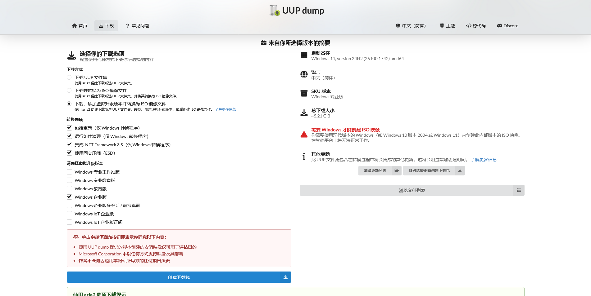
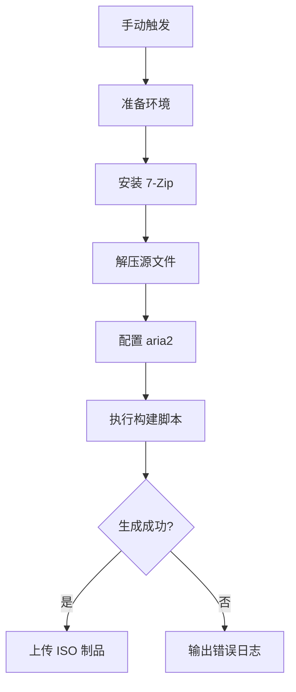

# Windows ISO 自动化构建工作流

基于 UUP dump 的 Windows ISO 自动构建工具，通过 GitHub Actions 实现云端编译和打包。

## 功能特性

✅ **已配置的构建参数**：
- 生成专业版 Windows 镜像 (Pro SKU)
- 目标内部版本号：`26100.1742`
- 启用固实压缩（生成 ESD 格式镜像）
- 集成以下组件/功能：
  - .NET Framework 3.5
  - Windows 更新补丁
  - 系统组件清理
- 添加虚拟升级版本支持
- 超时时间：180 分钟



## 使用方法

### 前置要求
1. 将源文件 `26100.1742_amd64_zh-cn_professional_e1d5e11a_convert_virtual.zip` 放置于仓库根目录
2. 确保 GitHub 仓库已开启 Actions 权限

### 执行构建
1. 进入仓库的 **Actions** 选项卡
2. 选择 **UUP Build and Package** 工作流
3. 点击 **Run workflow** 手动触发构建

### 获取镜像
- 构建完成后，在 Actions 运行页面下载 `windows-iso` 制品
- 镜像文件命名格式：`26100.1742.年月日-时分_*.iso`
- 制品保留时间：3 天

## 工作流流程图



## 技术细节

### 环境配置
- 运行平台：GitHub `windows-latest` runner
- 核心组件：
  - 7-Zip 24.09
  - aria2 1.37.0
  - UUP 转换脚本

### 日志诊断
- 构建失败时自动输出最后 50 行日志
- 日志目录：`source/logs/*.log`
- 自动验证文件结构：
  ```powershell
  Get-ChildItem -Path "$env:GITHUB_WORKSPACE\source" -Recurse
  ```

## 注意事项

⚠️ **重要提示**：
1. 源 ZIP 文件需包含完整的 UUP 转换文件
2. 建议每月清理旧制品以节省存储空间
3. 构建时间受 GitHub 服务器负载影响，通常需要 60-120 分钟
4. 若出现路径错误，请检查 ZIP 文件的内部目录结构

## 许可证
本项目基于 [MIT License](LICENSE) 授权，使用的第三方工具遵循各自许可证。